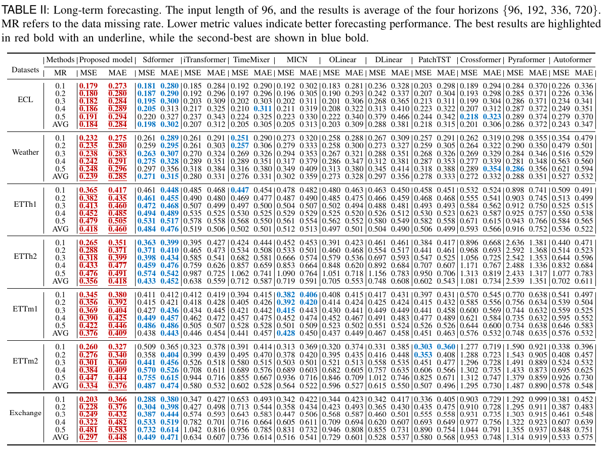
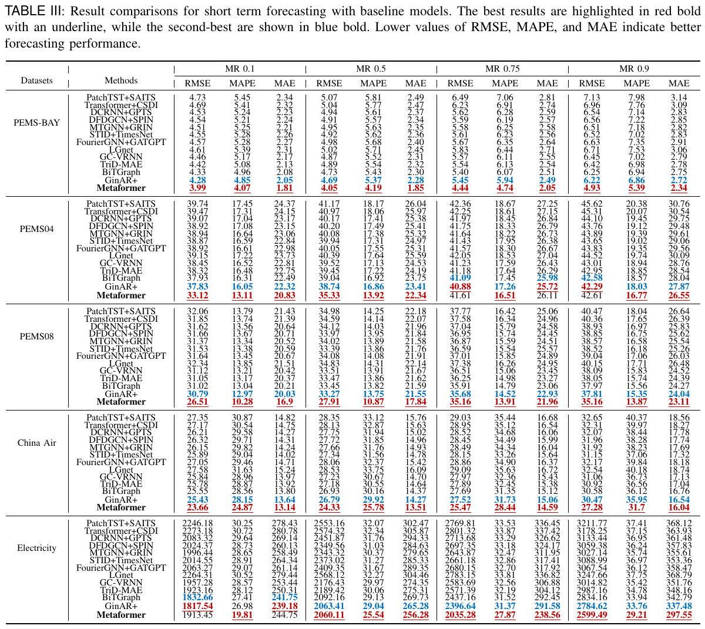

# MeaTS
An End-to-End Meta-Enhanced Attention for Time Series Forecasting with Missing Data

## Our Paper
Time series forecasting with missing values remains a critical challenge across diverse domains. While Transformer-based models excel with complete data, they suffer from "attention sink" where attention mechanisms disproportionately focus on missing data points, creating a self-reinforcing feedback loop that degrades performance. To address this, we propose MeaTS, a novel end-to-end Transformer-based framework specifically designed for robust multivariate time series forecasting with missing values. Our approach introduces two key innovations: (1) A meta-enhanced attention mechanism that dynamically adjusts attention weights by suppressing focus on missing values while amplifying attention to observed data, effectively mitigating the attention sink problem; (2) An extracted latent value module that transforms data with missing values into informative features through frequency-domain representations, enhancing data representation without explicit imputation. Extensive experiments demonstrate that Metaformer achieves a 19.86\% improvement in MAE compared to state-of-the-art models such as SDformer, GinAR+, and BiTGraph.


## Main Results

**Main Results:** 
Our MeaTS achieves the consistent SOTA performance on long and shor-term forecasting experiments.








## Get Started

1. Install Python 3.7 and necessary dependencies.
```
pip install -r requirements.txt

```
2. Download data. You can obtain all datasets from [[Times-series-library](https://github.com/thuml/Time-Series-Library)].

3. Long-term forecasting tasks.
 
We provide the long-term forecasting experiment coding in `./TCDNet` and experiment scripts can be found under the folder `./scripts`. To run the code on ETTh2, just run the following command:

```
cd ./MeaTS

sh ./scripts/long_term/ETTh2.sh
```

4. Short-term forecasting tasks.

We provide the short-term forecasting experiment coding in `./TCDNet` and experiment scripts can be found under the folder `./scripts`. Please run the following command:

```
cd ./MeaTS

sh ./scripts/short/ETTh1.sh
```


## Acknowledgement

We appreciate the following github repos a lot for their valuable code base or datasets:

https://github.com/ts-kim/RevIN

https://github.com/thuml/Time-Series-Library
